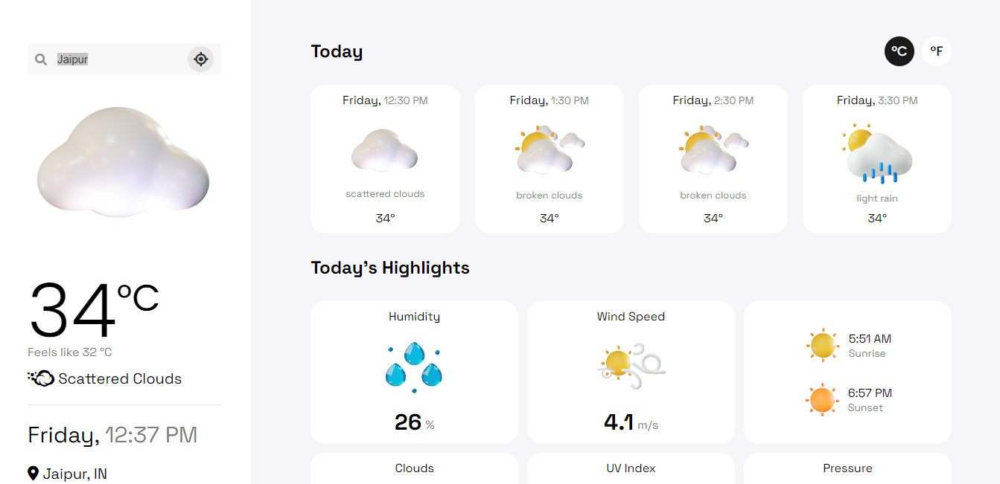
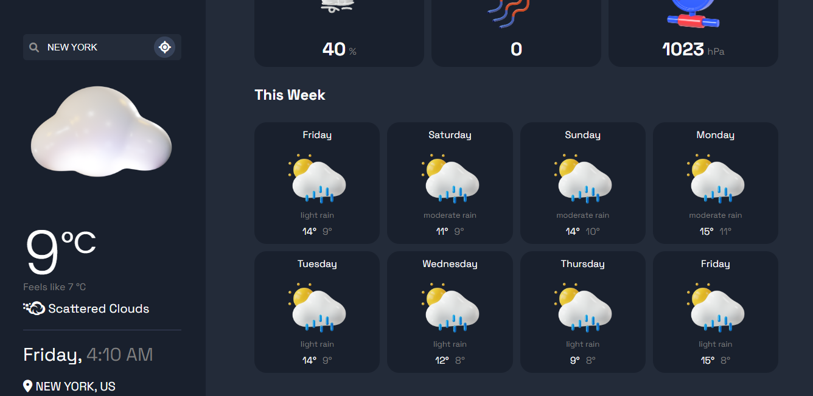

<div align="center">
    <b><a href="https://weather-app-v-2-0.vercel.app/" target="_blank">
    
    </a></b>
</div>

## Installation

```
$ npm install
```

## App Configuration

Get Your OpenWeatherMap API KEY here: https://home.openweathermap.org/api_keys

⚠️ **Important Instructions** ⚠️:

- Create `.env` file in root of the project.
- Change the desired value. _eg_ API Key

## Preview

## 🌐 **[Live Preview](https://weather-app-v-2-0.vercel.app/)**



## **Thank You! ❣️**
